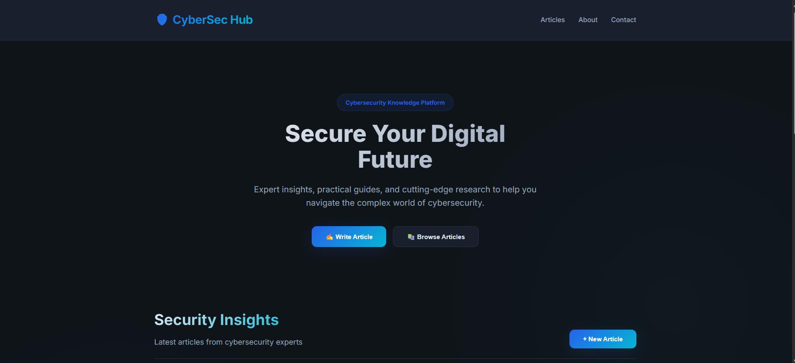
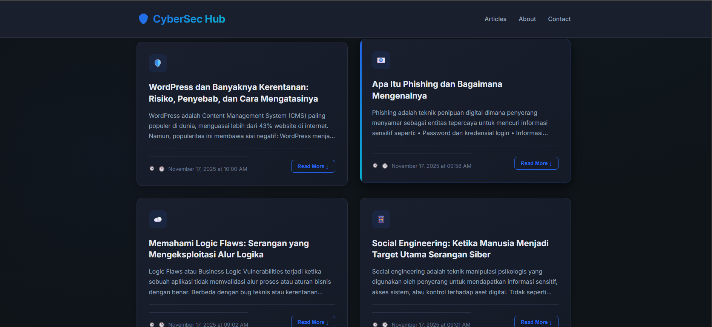
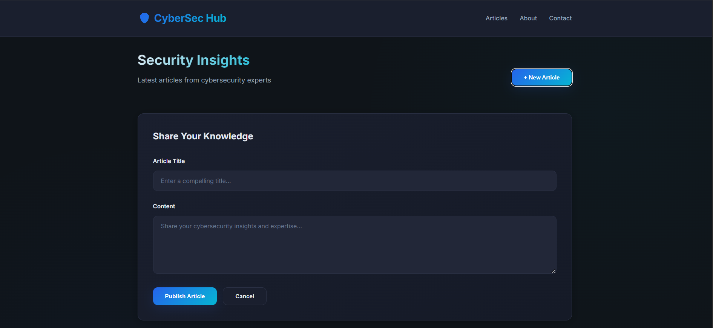

# 🛡️ CyberSec Hub - Cybersecurity Knowledge Platform
[]
[](https://docker.com)
A full-stack web application for sharing cybersecurity articles, tips, and tools. Built with modern technologies and containerized with Docker.

## 📸 Screenshots

### 🏠 Homepage



### 📚 Articles View



### ✍️ Add Article Form



## 🚀 Features

- **📚 Article Management** - Create and read cybersecurity articles
- **🎨 Elegant Dark UI** - Professional cybersecurity-themed design
- **🔧 RESTful API** - Node.js + Express backend
- **🗄️ MongoDB Database** - Persistent data storage
- **🐳 Docker Containerization** - Easy deployment
- **📱 Responsive Design** - Works on all devices
- **🔒 Security Features** - XSS protection, CORS setup

## 🛠️ Tech Stack

### Frontend

- HTML5, CSS3, JavaScript (ES6+)
- Modern CSS with Grid & Flexbox
- Responsive design with mobile-first approach

### Backend

- Node.js + Express.js
- MongoDB with Mongoose ODM
- CORS enabled for cross-origin requests

### DevOps

- Docker + Docker Compose
- Multi-container architecture
- MongoDB data persistence

## 📦 Project Structure
```bash
cybersec-web-hub/
├── backend/
│ ├── models/ # MongoDB models
│ ├── routes/ # API routes
│ ├── server.js # Main server file
│ ├── package.json
│ └── Dockerfile
├── frontend/
│ ├── index.html # Main HTML file
│ ├── style.css # Elegant dark theme CSS
│ ├── script.js # Frontend JavaScript
│ └── (assets/)
├── docker-compose.yml # Multi-container setup
├── .gitignore
└── README.md
```

## 🏃‍♂️ Quick Start

### Prerequisites

- Docker
- Docker Compose

### Running the Application

1. **Clone the repository**

   ```bash
   git clone <your-repo-url>
   cd cybersec-web-hub
   ```

2. **Start with Docker Compose**

   ```bash
   docker-compose up -d
   ```

3. **Access the application**
   -Frontend: Open frontend/index.html in browser
   -Backend API: http://localhost:5001/api
   -MongoDB: localhost:27017

## Development Setup

### Backend Development

    ```bash

cd backend
npm install
npm start

````

### Frontend Development
```bash
cd frontend
python -m http.server 8000
# Then open http://localhost:8000
````

## 🌐 API Endpoints

### Articles

-GET /api/articles - Get all articles
-POST /api/articles - Create new article
-GET /api/articles/:id - Get single article

### Health Check

-GET /api/health - API status check

## 🐳 Docker Services

-backend: Node.js API server (Port 5001)
-mongodb: MongoDB database (Port 27017)

### 🔧 Development

## Environment Variables

-MONGODB_URI: MongoDB connection string
-PORT: Backend server port (default: 5000)

## Building Containers

-docker-compose build
-docker-compose up -d

## Viewing Logs

-docker-compose logs backend
-docker-compose logs mongodb

### 📝 License
This project is licensed under the [MIT License](https://opensource.org/licenses/MIT). See the `LICENSE` file for more details.
